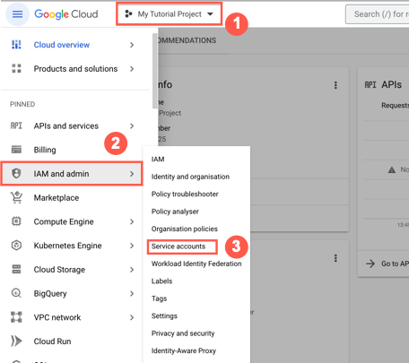
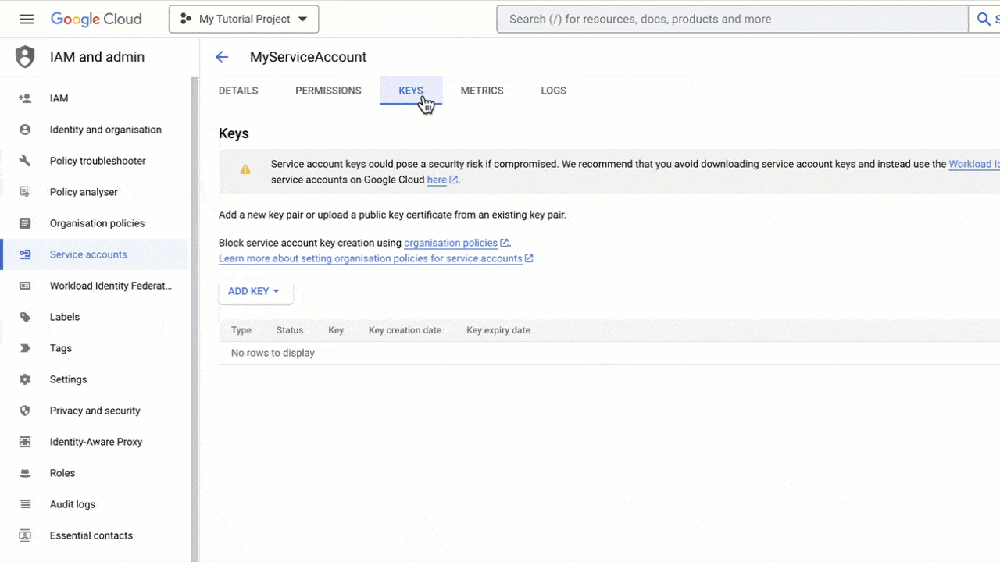
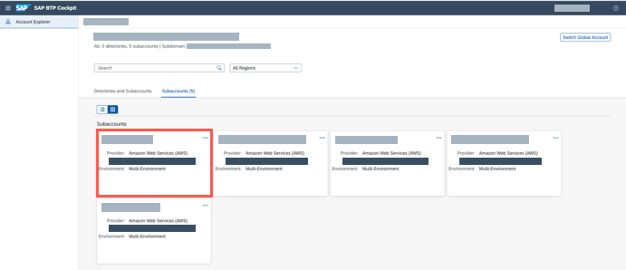
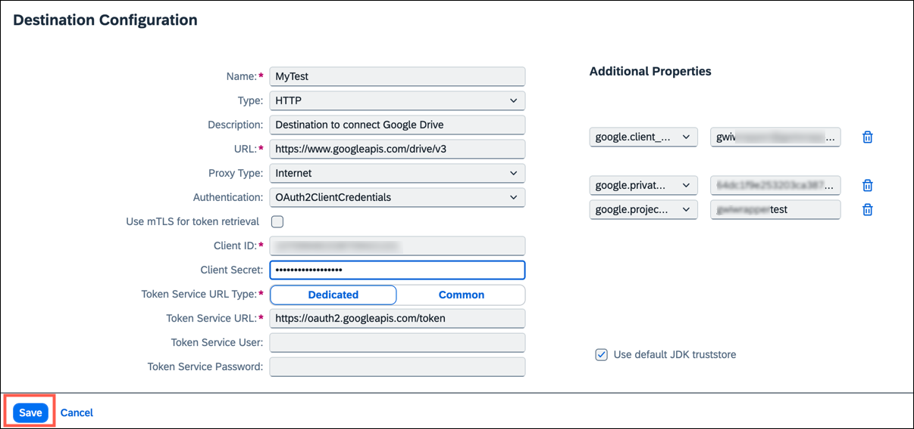

## Prerequisites
 - You've added entitlements for Document Management Service, Integration Option. For more information about entitlements, see [Configure Entitlements and Quotas for Subaccounts](https://help.sap.com/docs/btp/sap-business-technology-platform/configure-entitlements-and-quotas-for-subaccounts?version=Cloud)
 - You've created a service instance and service key of Document Management Service, Integration Option. For more information, refer to this tutorial [Create a Service Instance and then a Service Key of SAP Document Management Service, Integration Option](btp-sdm-gwi-create-serviceinstance).
 - You've added the roles `	SDM_User` and `SDM_Admin` for your user.
 - You've downloaded the JSON file with public/private key pair that is generated and downloaded to your local folder. For more information about the detailed steps, see [Configure Service Account Access](https://developers.google.com/workspace/guides/create-credentials?hl=en#create_credentials_for_a_service_account).

### You will learn
 - How to download key from the Google Cloud console
 - How to configure a basic HTTP destination
 - What are some of the additional properties you need to add while configuring the destination?
 - How to specify the Google parameters that are required to create a destination

### Information
  Destinations are key building blocks in SAP BTP, and are used to define connections for outbound communication from your application to remote systems. These remote systems can be on-premises or in the cloud. A destination has a name, a URL, authentication details, and some other configuration details.

---

[ACCORDION-BEGIN [Step 1: ](Download public/private key pair from Google Cloud)]

1. Logon to the [Google Cloud](https://console.cloud.google.com/projectselector2/iam-admin/serviceaccounts?pli=1&supportedpurview=project) console.

2. In the Google Cloud console, navigate to **Menu**, select your project and choose **IAM & Admin** > **Service Accounts**.

    !

3. Select and click on your service account. If it is not available, you can create a new one and select it.

    !

4. Once you are on the service account page, click **Keys** > **Add key** > **Create new key**. Select **JSON**, then click **Create**.

    !

>**Results:** Your new public/private key pair is generated and downloaded to your machine as a new file. The values from this file will be used in the next step, so please keep it accessible.

[DONE]
[ACCORDION-END]

[ACCORDION-BEGIN [Step 2: ](Access your subaccount)]
Click on the tile of your Cloud Foundry subaccount.

  !

[DONE]
[ACCORDION-END]

[ACCORDION-BEGIN [Step 3: ](Open the Destinations view)]
 Navigate to **Connectivity** and click on the **Destinations** button on the left panel. Click **New Destination** to open a new destination configuration form.

  !

[DONE]
[ACCORDION-END]

[ACCORDION-BEGIN [Step 4: ](Create new destination)]
Enter all the following fields in the destination configuration section and confirm with **Save**.

  Field Name     | Value
  :------------- | :-------------
  Name           | **`MyTest`**
  Type           | **`HTTP`**
  Description    | **`Destination to connect Google Drive`**
  URL            | **`https://www.googleapis.com/drive/v3`**
  Proxy Type     | **`Internet`**
  Authentication | **`OAuth2ClientCredentials`**
  Client ID      | **`A client ID that is obtained from a JSON file.`**
  Client Secret  | **`Enter the key from the JSON file`**
  Token Service URL Type | **`Dedicated`**
  Token Service URL | **`A token URI that is obtained from a JSON file.`**

  And the following **Additional Properties**:

  >  Note:  Open the downloaded JSON file with public/private key pair from Google service accounts. For more information about the detailed steps, see [Configure Service Account Access](https://developers.google.com/workspace/guides/create-credentials?hl=en#create_credentials_for_a_service_account).

  Property Name     | Value
  :------------- | :-------------
  `google.client_email` | *A client email obtained from a JSON file.*
  `google.private_key_id` | *A private key ID obtained from a JSON file*
  `google.project_id` | *A project ID obtained from a JSON file*

  > **Note:**
  When connecting your services to SAP BTP services and on-premise systems, credentials are exposed in plain text to the person performing the configuration. Make sure that you've operational countermeasures in place to prevent unauthorized copies of credentials from being leaked.

  When you specify a URL with the HTTPS scheme, a checkbox Use default **JDK truststore** will appear. Ensure that this is checked.

  !

[DONE]
[ACCORDION-END]

[ACCORDION-BEGIN [Step 5: ](Check connection)]

Click on the `Check Connection` icon on the newly created Destination to see if everything works.

  !

[DONE]
[ACCORDION-END]

[ACCORDION-BEGIN [Step 6: ](Test yourself)]

 [VALIDATE_6]

[DONE]
[ACCORDION-END]

---
