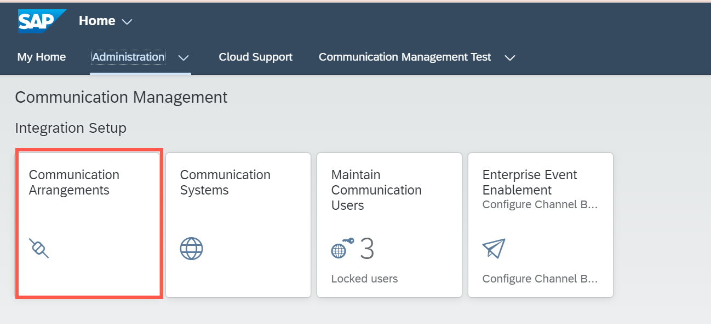
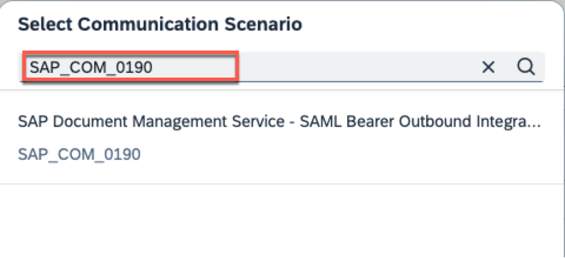
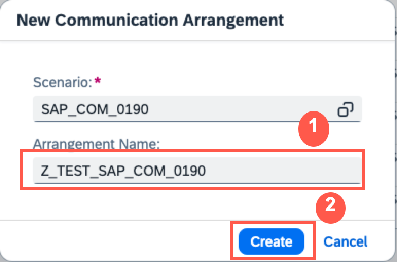
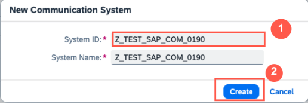
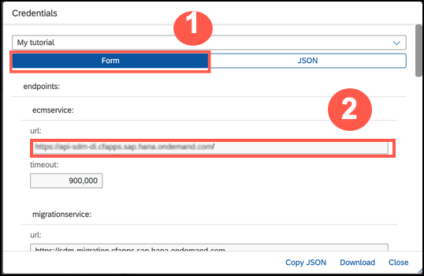
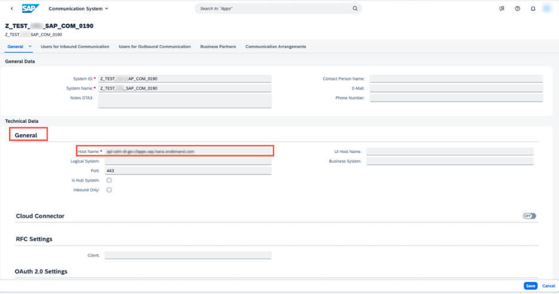
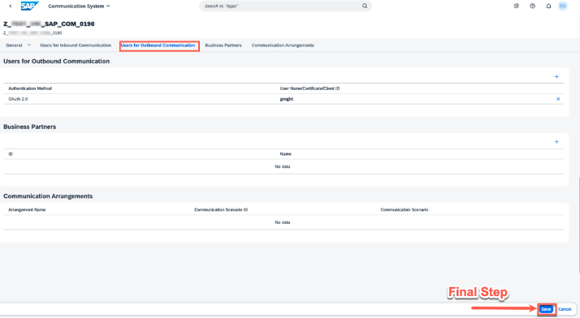

## Prerequisites
 - You've access to SAP S/4HANA Cloud, public edition with admin privileges.
 - You've created a service instance and service key of Document Management Service, Integration Option. For more information, see [Create a Service Instance and then a Service Key of SAP Document Management Service, Integration Option](btp-sdm-gwi-create-serviceinstance).
 - From the generated service key, you copied the **`ecmservice`** URL. Your `ecmservice` URL would look something like `https://api-xyz-dm-gw.cfapps.sap.hana.ondemand.com/`.
 - You've copied the `clientid`, `clientsecret`, and `tokenurl` parameters generated in the same subaccount of Cloud Foundry environment where Document Management Service, Integration Option instance is created.

### You will learn
 - How to use the existing communication scenario `SAP_COM_0190`
 - How to add details from the service key generated from SAP BTP to SAP S/4HANA cloud, public edition
 - How to add the details that are captured from SAP BTP in SAP S/4HANA Cloud, public edition
---

[ACCORDION-BEGIN [Step 1: ](Create communication arrangements)]

1. Log on to the SAP S/4HANA Cloud, public edition and search for the **Communication Arrangements** app.

    !

2. Choose **New**.

    !

3. Select the communication scenario **`SAP_COM_0190`**.

    !

4. Enter a name as `Z_TEST_SAP_COM_0190` for the arrangement in **Arrangement   Name** and choose **Create**.

    !

>**Results:** Communication Arrangement has been created, and you're directed to the communication arrangement page to configure further settings.
  Stay on the same page and proceed to the next step.

[DONE]
[ACCORDION-END]

[ACCORDION-BEGIN [Step 2: ](Create communication system)]

1. In the Communication Arrangement page that you created in the previous step, choose **New** and create a **New Communication System**.

      !

2. Enter the System ID as `Z_TEST_SAP_COM_0190` and choose **Create**.

      !

3. Upon creating the communication system, stay at the same page and navigate to the **Technical Data > General**.

    You have already copied the service key from your SAP BTP Subaccount, in the generated service key. Your `ecmservice` URL would look like this `https://api-xyz-gh-gw.cfapps.sap.hana.ondemand.com`. Ensure that you copy the URL without the prefix `https://`.

      !

    Paste it in the **Host Name**.

      !

4. Enter the **Authorization** and **Token Endpoints** under **OAuth 2.0 Settings**.

    To enter **Authorization Endpoint**, copy the authentication URL listed under `uaa` of your service key. Delete `https://` from the URL and add `/oauth/ authorize` as suffix to the URL. For example, `<subaccountname>.authentication.sap.hana.ondemand.com/oauth/authorize`.

      !

5. Enter **Token Endpoint**, This is the URL that you copied while establishing trust configuration between SAP S/4HANA Cloud, public edition and SAP BTP (You can check **Step 4** in [Trust Configuration between SAP S/4HANA Cloud, public edition and SAP BTP Subaccount](btp-sdm-gwi-s4hanacloud-export)).Ensure that you remove the prefix `https://` before pasting it in the field.

    !

6. In the **Audience** field, copy the authentication URL with `https://` listed under `uaa` of your service key. For example, `https://<subaccountname>.authentication.sap.hana.ondemand.com`. Check **Step 2.5** in [Create a Service Instance and then a Service Key of SAP Document Management Service, Integration Option](btp-sdm-gwi-create-serviceinstance).

    !

7. Scroll down to the section **User for Outbound Communication** and choose **+ Add** (plus button) to create new outbound user.

    !

8. In the **New Outbound User** dialog, select **`OAuth 2.0`** in **Authentication Method** field.

    Enter `client ID` that you copied from the service key in the **OAuth 2.0 Client ID** field. Enter `clientsecret` that you copied from the service key in the **Client Secret** field.

    !

    Choose **Create**.

9. **Save** the Communication System.

    !

[DONE]
[ACCORDION-END]

[ACCORDION-BEGIN [Step 3: ](Enter additional properties)]

1. In the **Communication Arrangement** you created, in the **`Additional Properties`** section, maintain the following details:

    | Property Name | Property Value
    | :------------- | :-------------
    | File Share ID | **`ZTEST`**
    | File Share Type | **`2`**
    | Repository ID | **`MyTutONBRepo`**. Ensure that you've added the *`externalID`* as repo ID that you onboarded while executing the tutorial [Create a Repository Using the Onboarding API for Google Drive](https://developers.sap.com/tutorials/btp-sdm-gwi-onboarding-repo.html). Refer to the **Step2.4**.
    | Description | **`For tutorial purposes`**

    !

2. In **Outbound Services** section, maintain the following details:

    | Field Name | Value
    | :------------- | :-------------
    | Path | **`/browser`**
    | Port | **`443`**

    !

3. Choose **Save**.

[DONE]
[ACCORDION-END]
