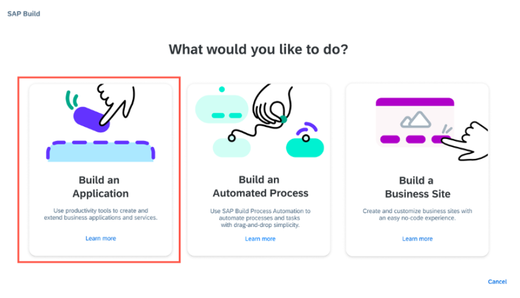
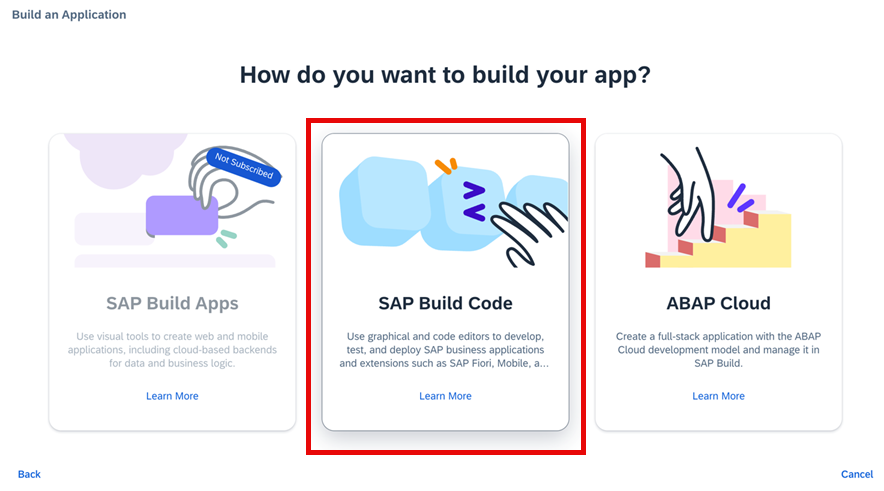
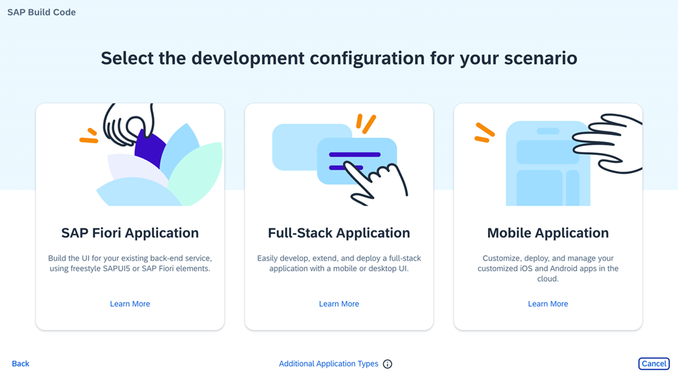
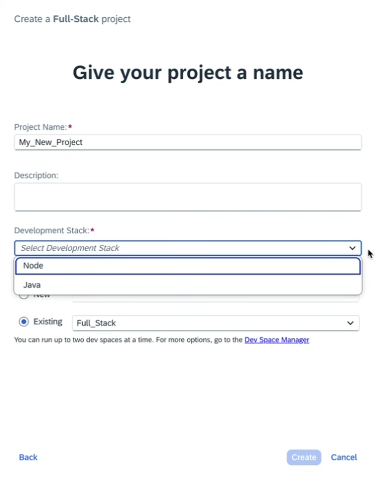
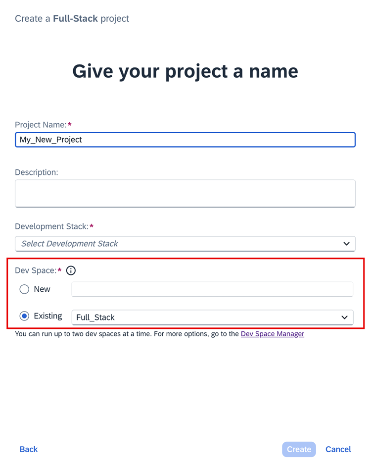
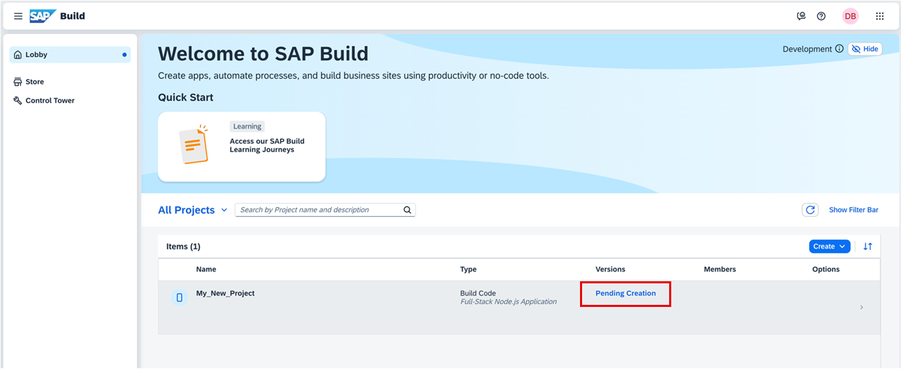

# Create an SAP Build Code Application from the Lobby
<!-- description --> In this tutorial, you will learn how to create an application starting from the SAP Build lobby. 

## You will learn
- To leverage the SAP Build Code features.
- To navigate the SAP Build lobby.

## Prerequisites
- You have an SAP BTP Trial account ([Get a Free Account on SAP BTP Trial](hcp-create-trial-account)).
- You have completed the [Setup SAP Build Code](https://developers.sap.com/tutorials/build-code-setup.html) tutorial. 

### Create a New Project 

>**Note** This tutorial assumes that you are using an SAP BTP trial account. If you are using a different account, some steps might be different.

1. Navigate to the SAP Build lobby.

2. Click **Create**, and from the dropdown list, select **Create**.  

    <!-- border -->

    Under the **Create** option, you also add existing projects to your SAP Build workspace in the following ways:

    * **Clone from Git**: to clone an existing project from a Git repository.
  
    * **Add from Dev Space**: to add a project from an existing SAP Business Application studio dev space to your SAP Build Code tenant.

3. Click the **Build an Application** tile.

    <!-- border -->

4. Click the **SAP Build Code** tile to develop your project in SAP Business Application Studio, the SAP Build Code development environment, leveraging the capabilities of the services included in SAP Build Code.
   
    <!-- border -->

5. Select the type of application you want to create.
   
    <!-- border -->

    * Select **SAP Fiori Application** to build UI using freestyle SAPUI5 or SAP Fiori elements.
    * Select **Full-Stack Application** to create an application of type **Full Stack with Productivity Tools**. This will enable you to develop, extend, and deploy your app. You can provide the app with a desktop or mobile UI. 
    * Select **Mobile Application** to customize, deploy, and manage your customized iOS and Android apps in the cloud.

6. Enter a name for your project.

7. If you selected a Full Stack application, select **Node** or **Java** as your development stack.

    <!-- border -->

8. Select the dev space where you want the project to reside.
    >SAP Build Code recommends the dev space it deems most suitable, and it will automatically create a new one for you if you don't already have one. If you have other dev spaces of the same type (for example, Full-Stack), you can select between them. If you want to create a different dev space, or a dev space or another type, go to the Dev Space Manager. See [Working in the Dev Space Manager](https://help.sap.com/docs/build_code/d0d8f5bfc3d640478854e6f4e7c7584a/ad40d52d0bea4d79baaf9626509caf33.html?locale=en-US).

    <!-- border -->

9.  Click **Create**.

    You can see the project being created in the Project table of the lobby.  
    >The creation of the project may take a few moments.

    <!-- border -->

10. After you see a message stating that the project has been created successfully, click the project to open it.

    <!-- border -->

    The project opens in SAP Business Application Studio, the SAP Build Code development environment.

    