# Design and Deploy Your First Integration Flow
<!-- description --> Design an integration flow to integrate an online webshop that exposes data via OData service and fetch the product details.

## Prerequisites
 - You have provisioned your SAP Integration Suite tenant. For more information, see [Set Up Integration Suite Trial](cp-starter-isuite-onboard-subscribe).

## You will learn
  - How to design and deploy an integration flow using the web-based integration flow designer
  - How to design an integration flow to fetch data from an online web shop that is available as an OData service

  ### Create an integration package and integration flow

1. Choose **Design** > **Integrations and APIs** > **Create** to create an integration package.

    >An integration flow must be associated with an integration package.

      In the **Header** tab, provide a **Name** and **Short Description** for your integration package.

    >The **Technical Name** gets populated automatically based on the name that you provide.

      Choose **Save** and then choose **Artifacts**. In this tab, you will create your first integration flow.

      <!-- border -->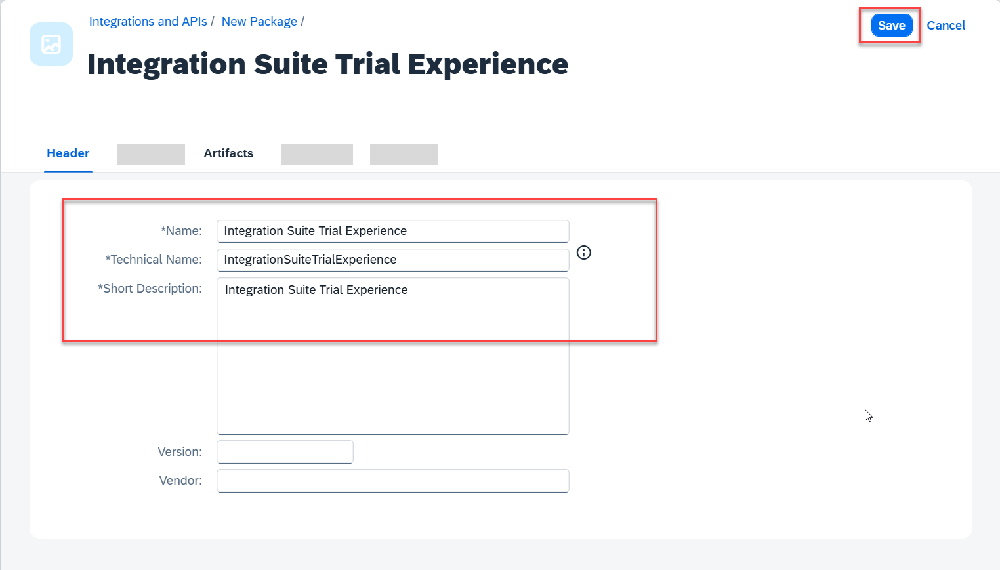

2. Choose **Add** > **Integration Flow**.

      <!-- border -->

      Enter a **Name** for the integration flow and choose **Add and Open in Editor**.

      <!-- border -->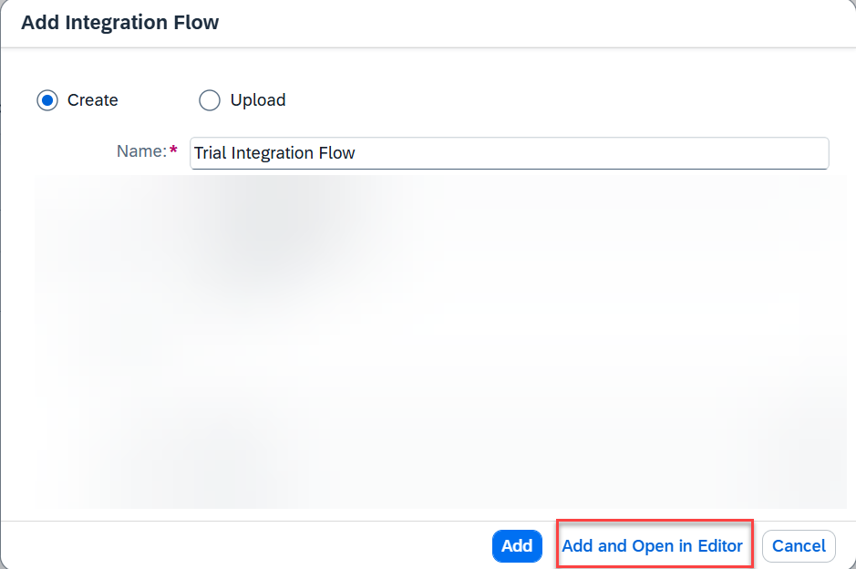

3. Choose **Edit** to start editing the integration flow.

    Choose **Restore** at the bottom right corner to bring up the **Property Sheet**. Property sheet is the place where you define the parameters for every step in the integration flow.

      <!-- border -->

### Connect sender channel with HTTPS adapter

In this step, you define your sender channel and sender adapter. In this case, we use a HTTPS sender adapter.

1. Choose the **Sender** step. Create the sender channel by clicking the arrow icon on **Sender** and dragging it to the **Start** step.

    <!-- border -->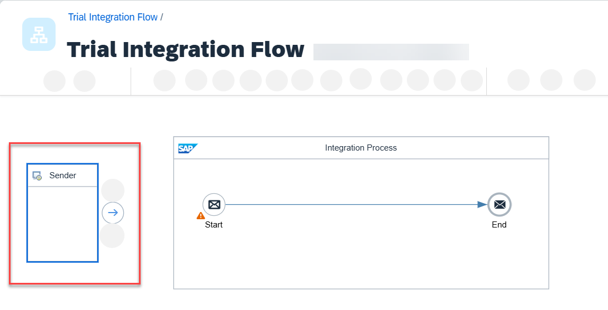

2. In the **Adapter Type** prompt, select the **HTTPS** adapter.

    <!-- border -->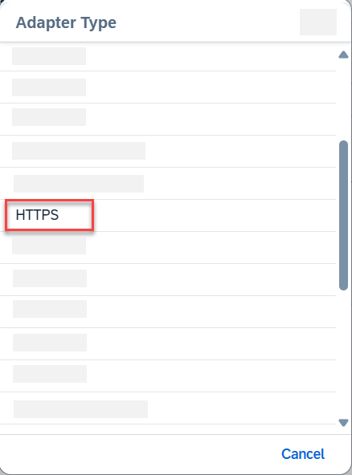

3. In the property sheet, select the **Connection** tab. In the **Address** field, enter **`/products/details`**.

    Optionally, you can enter any value of your choice, but ensure that you use **"/"** symbol before specifying the endpoint name. Deselect the **CSRF Protected** checkbox (this will be selected by default).

    <!-- border -->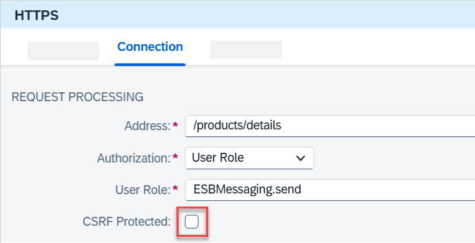

### Add JSON to XML converter

Input to the integration flow is sent in JSON format. At a later point, you communicate to a web shop, which is a OData service that understands only XML. You use a converter for this JSON to XML conversion. After the input is converted into XML, the message is sent as header information to the OData service to fetch the required product details.

1. From the palette (the grey bar on the top containing integration flow steps), choose **Message Transformers > Converter > JSON to XML Converter**.

    <!-- border -->

2. Connect the converter to the message path by clicking on the message path.

    <!-- border -->

### Add and configure content modifier

The Content Modifier allows you to modify a incoming message by changing the content of the data containers that are involved in message processing (message header, message body, or message exchange). The data written to the message header using a Content Modifier also becomes part of the outbound message addressed to a receiver system. For more information about Content Modifier, see [Content Modifier Basics](https://help.sap.com/docs/integration-suite/sap-integration-suite/content-modifier-basics).

1. Choose **Message Transformers > Content Modifier** and add it to the message path, as you did for the **JSON to XML Converter**.

    <!-- border -->

2. In the property sheet, choose **Message Header > Add** to configure the **Content Modifier**. Enter the following parameters:

    |  Field Name     | Description
    |  :------------- | :-------------
    |  **Action**           | **`Create`**
    |  **Name**           | **`productIdentifier`**
    |  **Source Type**        | Select **`XPath`** from the dropdown list
    |  **Source Value**       | **`//productIdentifier`**
    |  **Data Type**    | **`java.lang.String`**

    <!-- border -->

### Add request reply step

Certain integration scenarios might require that Cloud Integration communicates with an external service, retrieves data from it, and further processes the data. In such cases, you can use the request reply step as an exit to connect to the external service.

From the palette, choose **Call** > **External Call** > **Request Reply**. Connect it to the message path, similar to the previous steps.

  <!-- border -->

  <!-- border -->

You have now created a step that will (in the further step) connect and communicate with on OData service, and retrieves data from it.

### Connect request reply to receiver

1. Move the **Receiver** step below the **Request Reply** step by selecting it and dragging it to the desired position on the editor. You do this to ensure that your integration flow is elegantly designed.

    >**TIP:** Use the pan and zoom controls (highlighted in yellow) for resizing the canvas. Use the guidelines to ensure that **Receiver** is aligned with the **Request Reply** step.

    <!-- border -->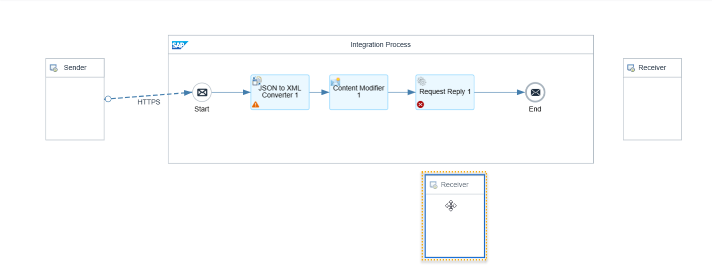

2. Connect the **Request Reply** to **Receiver** by dragging the arrow icon on **Request Reply** to the **Receiver**.

    <!-- border -->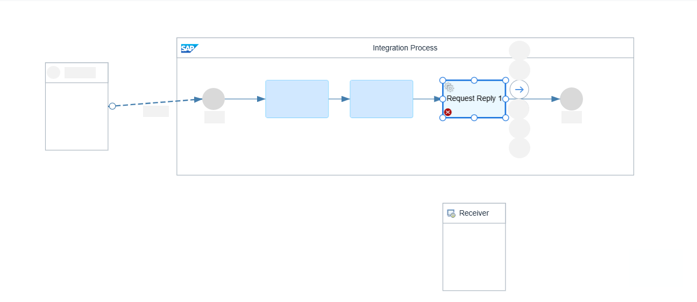

3. In the **Adapter Type** prompt, select **OData**. In the **Message Protocol** prompt, select **OData V2**.

    <!-- border -->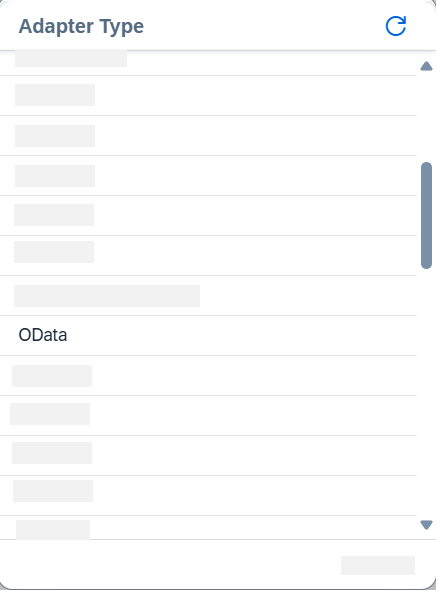

    <!-- border -->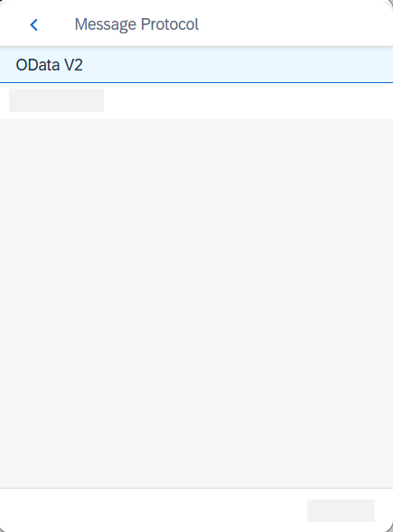

4. Select the **Connection** tab. In the **Address** field, enter **`https://refapp-espm-ui-cf.cfapps.eu10.hana.ondemand.com/espm-cloud-web/espm.svc`**. This is the URL of the online web shop from which you will fetch the product details.

5. Select the **Processing** tab and choose **Select** in the **Resource Path** field.

    <!-- border -->

6. Ensure the connection details are the same and choose **Step 2**.

7. Choose the **Select Entity** field and choose **Products** from the dropdown list.

    <!-- border -->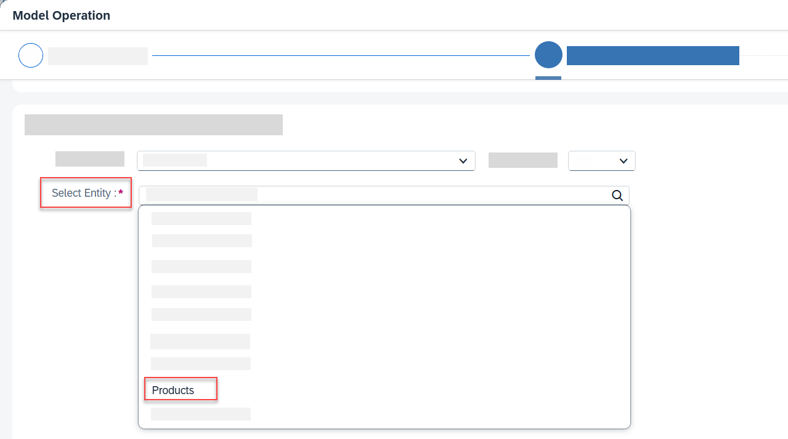

8. Enable the **Select All Fields** checkbox and choose **Step 3**.

    <!-- border -->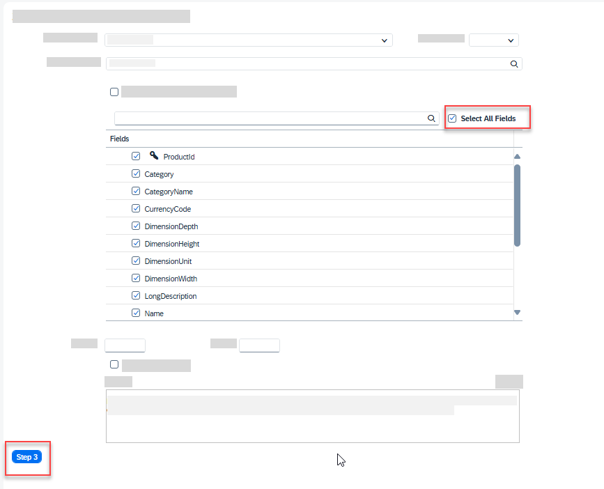

9. In the **Filter By** section, choose the **Select Field** icon.

    <!-- border -->

10. Choose **Product ID** and then **OK**.

    <!-- border -->

11. In the dropdown list, select **Equal**. In the value field, enter **`${header.productIdentifier}`**. Choose **Finish**.

    <!-- border -->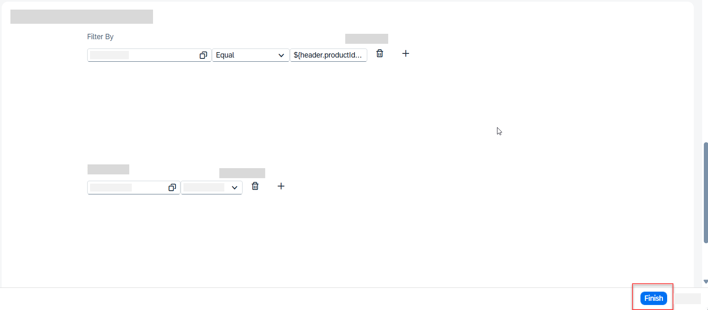

12. Choose **Save**.

Now you have configured the OData adapter to fetch the details of the product based on the product ID that you send as input while making the HTTP call.

### Deploy the integration flow

1. Choose **Deploy** to deploy the integration flow. Choose **Yes** in the confirmation dialog for deployment. Upon deployment confirmation, choose the **Deployment Status** tab in the property sheet.

    <!-- border -->

2. In the **Deployment Status** tab, you can see details about the deployment for the integration flow. The expected deployment status is **Deployed** and runtime status is **Started**.

    <!-- border -->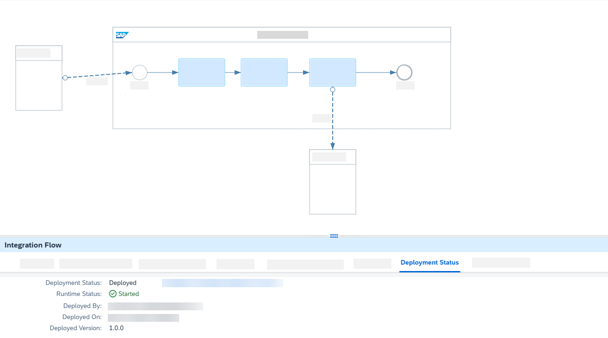

Later in the mission, you will use the endpoint of the deployed integration flow in a subsequent step. You will define the integration flow endpoint as application programming interface (API). And finally, call the integration flow API using API Management.

